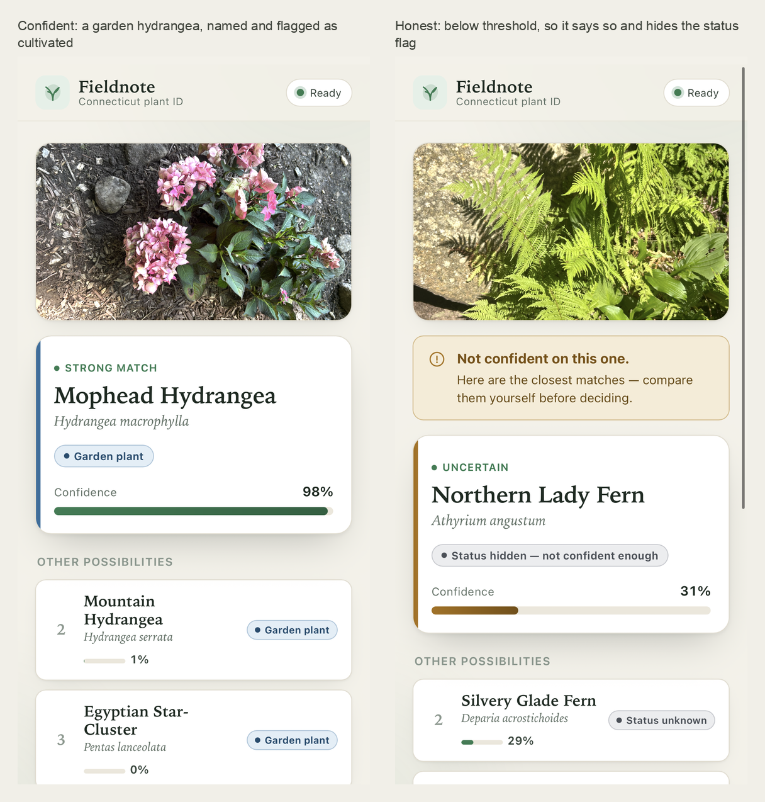
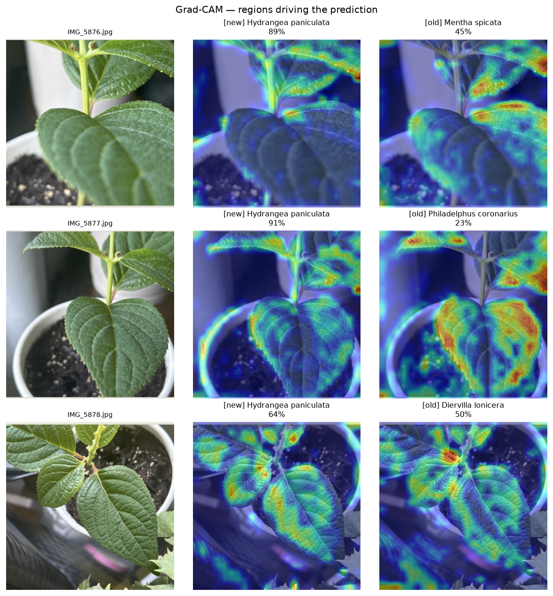
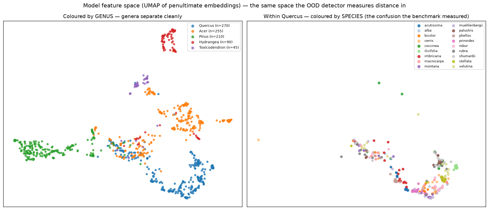
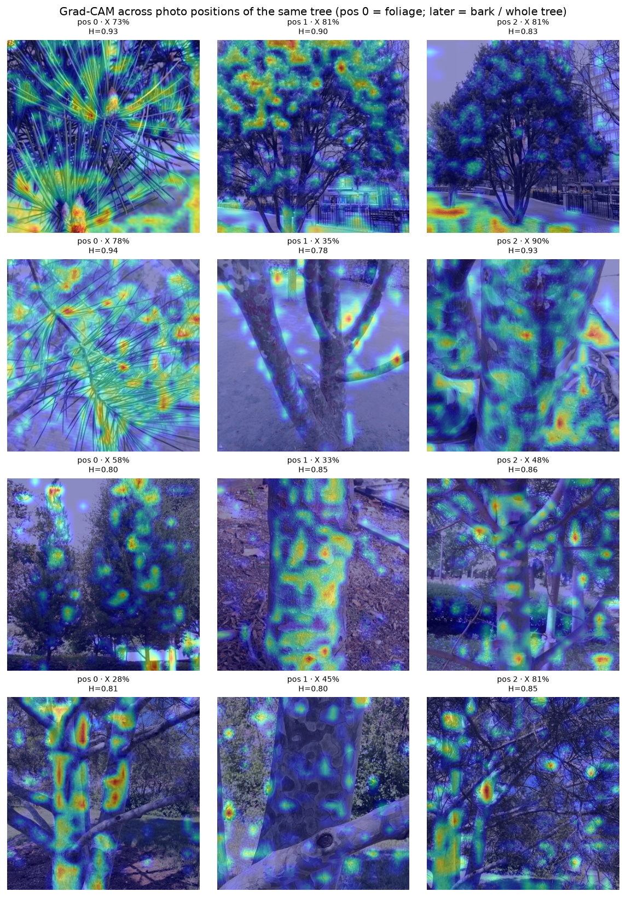

# Fieldnote — Connecticut plant ID

**Live: [fieldnote.kylelevesque.me](https://fieldnote.kylelevesque.me)**

Point your phone at a plant. Fieldnote names the species, tells you whether it's
native, introduced, invasive, or a garden plant — and tells you when it isn't
sure.

It covers **2,510 Connecticut species**, trained on **538k photos**, and runs as
an installable web app on a $12/month server.



---

## What I built

| | |
|---|---|
| **Dataset** | 538k iNaturalist photos across 2,510 species, pulled from the AWS Open Data bucket, split by *observation* so two photos of the same plant can't land on both sides of the train/test line |
| **Model** | EfficientNetV2-S fine-tuned in two stages (224px → 384px), a few GPU-hours on a rented A10 |
| **Accuracy** | 80.1% top-1 on held-out photos across all 2,510 species |
| **App** | FastAPI backend + vanilla-JS PWA — camera capture, ranked candidates, offline-capable, installs to the home screen |
| **Deploy** | systemd + Caddy on a DigitalOcean droplet, automatic HTTPS, ~0.1s per identification on CPU |

The model predicts **species only**. Whether something is a weed is a *lookup*,
not a visual class — "weed" depends on where you're standing, so it lives in a
separate attributes table keyed by species.

---

## The parts I'm actually proud of

Most of the interesting work wasn't the accuracy number. It was figuring out
what the model was doing when it got things wrong.

### 1. A confident wrong answer, and the picture that explained it

The first real field test was a hydrangea in my mom's garden. Three photos from
three angles gave three different confident wrong species — and one of them came
back flagged as an invasive weed at 78%. That's the worst possible failure:
confidently wrong about something with consequences.

The cause turned out to be scope. iNaturalist's research-grade data deliberately
excludes cultivated plants, so **hydrangeas were not in the model's vocabulary at
all.** It was forced to pick a nearest neighbour among 2,360 wild species.

I retrained with 150 common garden ornamentals added, then used **Grad-CAM** — a
heatmap of which pixels drove the prediction — to compare the old model to the
new one on the exact same photos:



Both models look at the **same thing**: leaf margins, serrations, venation — the
features a botanist would use. The old model was never failing to *see* the
plant. It saw the right evidence and had nowhere to put it, so it landed on mint,
then mock-orange, then bush-honeysuckle.

**So the fix was a vocabulary problem, not a perception problem.** That's a much
sharper claim than "the model now works," and the picture is what let me make it.
All three photos now come back *Hydrangea paniculata* at 89 / 91 / 64%.

### 2. Why the app says "some kind of oak"

I plotted the model's internal representation — the 1,280-number summary it
builds before making a decision — squashed down to 2D with UMAP. Left panel is
coloured by genus, right panel zooms into oaks and colours by species:



Genera separate cleanly. *Hydrangea* is its own island; *Pinus* has a whole
region; *Toxicodendron* (poison ivy — the one that actually matters for safety)
is a tight isolated cluster.

Inside *Quercus*, there is **no species structure at all**. Red oak, white oak,
black oak, pin oak — completely interleaved.

That is a picture of a number my tree benchmark had already produced: **35%
species accuracy on oaks, 69% genus accuracy.** The information the model
reliably has *is the genus*.

So I shipped a **genus fallback**: when the model is confident about the group
but not the species, the app leads with *"Some kind of oak — 81%"* instead of
guessing a specific oak at 40%. A useful, true answer replaces a precise, wrong
one. The confidence bar switches to the genus number too, so the meter never
overstates what's being claimed.

### 3. A hypothesis I got to disprove

Bark and whole-tree photos are much harder than leaf close-ups. My assumption was
that the model gets *lost* on them — nothing to lock onto, attention smeared
across the frame. I tested it on 383 photos, using each photo's position within
an observation as a proxy for shot type (people shoot the leaf first, then the
bark, then the whole tree).



| shot | accuracy | attention entropy |
|---|---|---|
| leaf close-up | 40.7% | 0.848 |
| second photo | 32.0% | 0.852 |
| third photo | 25.3% | 0.844 |

Accuracy collapses, exactly as expected. **Attention entropy doesn't move at
all.** The model isn't lost on a bark photo — it attends just as decisively and
reads it wrong, applying foliage-shaped reasoning to a picture of a trunk.

Half my hypothesis was right and half was wrong, which is more useful than
either.

### 4. Making the confidence number honest

The percentage the app displays is *calibrated*, not raw. The raw model was
badly **under**confident: at a displayed 25% it was actually right about 79% of
the time, so the app's "not sure" warning was firing on good answers.

I fit a single temperature parameter on held-out data (Guo et al., 2017), which
took expected calibration error from **0.20 → 0.05**. A displayed 80% now really
does mean right about 80% of the time.

Then I checked it against reality: 54 paired backyard photos through both
Fieldnote and PictureThis. Agreement tracks the confidence label perfectly, with
no inversions:

| Fieldnote says | genus agreement with PictureThis |
|---|---|
| Strong match | 74% |
| Likely match | 57% |
| Possible match | 43% |
| Uncertain | 33% |
| Out of range | 0% |

The confidence means something on photos the model has never seen. That's the
result I care most about.

Other honesty machinery: an **out-of-distribution detector** (Mahalanobis
distance in that same feature space) that says "this looks outside my range"
rather than forcing a guess; **status flags are suppressed** below "Likely," so
the app never calls something invasive on a coin flip; and a **hazard flag** for
poison ivy, giant hogweed, and 21 other species that fires even when everything
else is hidden — "will this hurt me" outranks "is this native."

---

## What it doesn't do well

- **Trees.** 49.7% species / 67.7% genus, against PictureThis's published
  97.3% / 83.9% on a comparable set. That gap is real and too large to caveat
  away. The headline 80.1% is dominated by herbaceous plants with distinctive
  flowers; accuracy is not uniform across plant types.
- **Rare species.** Roughly 500 CT species have exactly one observation on
  iNaturalist. They exist in the output space but were never really learned, and
  a class that was never learned can still come back confidently wrong.
- **Native/introduced status** is filled in for 52% of species, and the missing
  half skews native — so don't read the status split as a fact about CT flora.
  Documented in [`docs/data_card.md`](docs/data_card.md).
- **Not a safety tool.** Don't eat anything based on it.

---

## Repo

```
app/                 FastAPI backend + PWA frontend
src/ctplantid/       model loading, inference, calibration, OOD, genus fallback
scripts/             data pull, training, evaluation, interpretability figures
reports/             what was measured, and the figures above
docs/                data card, training write-up, benchmark methodology
tests/               36 tests, no GPU or model download required
```

```bash
python3 -m venv .venv && .venv/bin/pip install -r requirements.txt
.venv/bin/python -m pytest -q
.venv/bin/uvicorn app.main:app --port 8700    # needs runs/b_stage2/model.pt
```

Fuller write-ups: [`reports/interpretability.md`](reports/interpretability.md),
[`reports/tree_benchmark.md`](reports/tree_benchmark.md),
[`reports/field_comparison_picturethis.md`](reports/field_comparison_picturethis.md).

Training data is iNaturalist Open Data (CC0 / CC BY / CC BY-NC). iNaturalist's
terms prohibit commercial ML use, so Fieldnote stays free.
