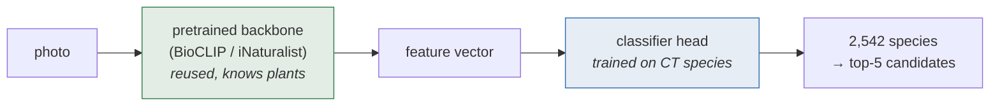
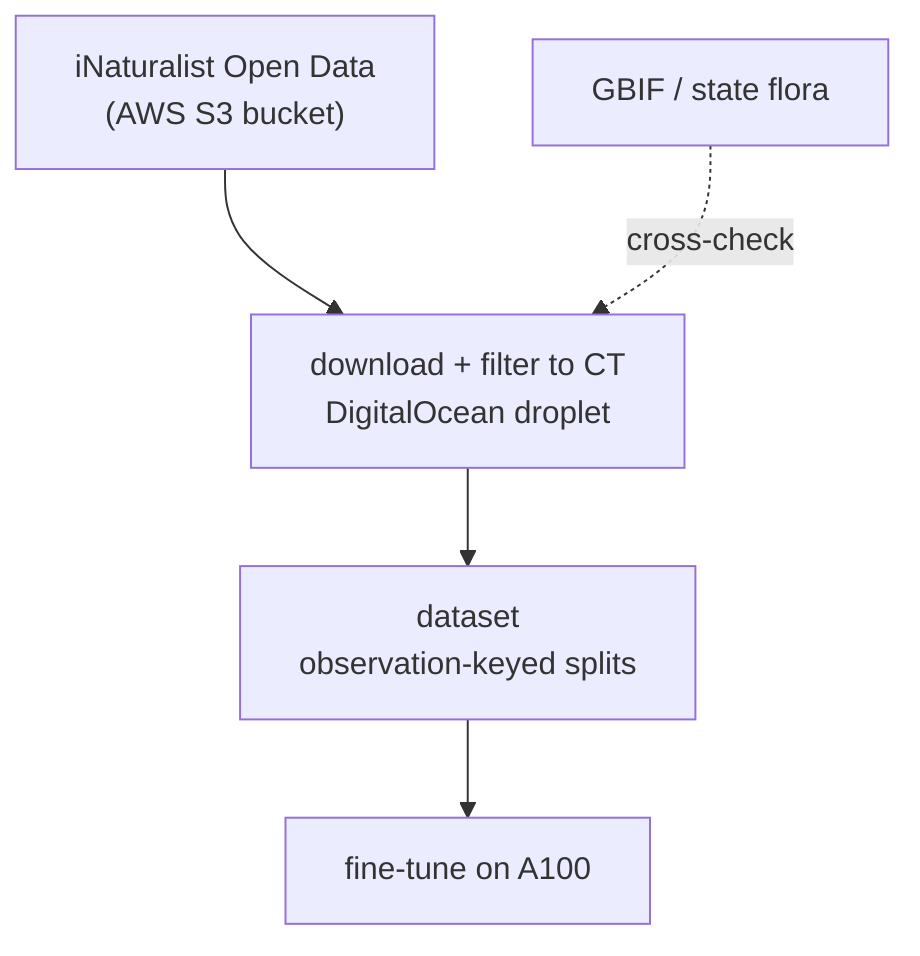
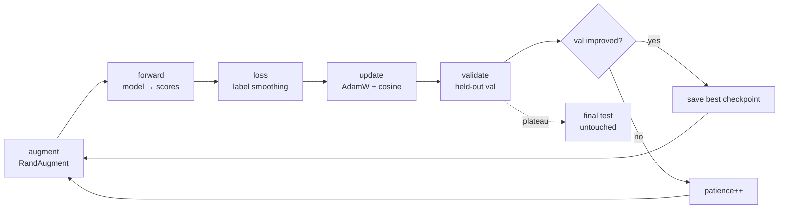
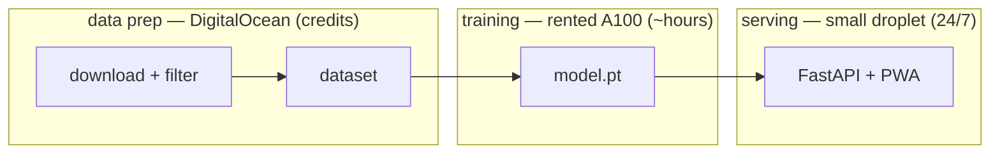

# Model & training — full documentation

How the CT plant classifier is built, trained, and served. Written to be
readable end-to-end; the diagrams use Mermaid (renders on GitHub and in most
editors).

## 1. Goal and scope

Identify any plant photographed in Connecticut — **comprehensive coverage of
all ~2,542 vascular species** recorded in the state (per the iNaturalist
recon in `data_recon.md`), not a convenient subset. The model predicts a
**species**; a separate lookup turns that into the native / invasive / weed
answer (a weed is contextual, not a visual class).

### The long-tail reality (why "comprehensive" is defined carefully)

Species image counts are wildly uneven:

| tier | iNat observations | species | reliability |
|------|-------------------|---------|-------------|
| head | ≥ 100 | 464 | strong, measurable |
| mid  | 20–99 | 512 | good |
| tail | 5–19 | ~580 | weak; few-shot territory |
| sparse tail | 1–4 | ~985 (497 with exactly 1) | best-effort; **not reliably learnable or measurable** |

You cannot train or even *measure* a species classifier from one photo. So
"comprehensive" is delivered honestly:

- the **class space includes all 2,542** species (the app can name any),
- the **head/mid are strong and measured** with held-out accuracy,
- the **sparse tail is few-shot**, leaning on the pretrained backbone's prior
  knowledge, and is surfaced with **low confidence + candidate list + genus
  fallback**, never a false-confident single guess.

Every metric is reported **stratified by tier**, so the strong part is never
allowed to hide the weak part.

## 2. The model — transfer learning

We do not train a plant brain from scratch. We reuse a **backbone** that
already understands plants and train only a new **classification head** on
Connecticut species.

**Backbone (reused, green).** Instead of an ImageNet backbone (which learned
cars, furniture, dogs), we start from one **pretrained on the tree of life** —
BioCLIP or an iNaturalist-pretrained ViT/ConvNeXt. This is the single biggest
lever for two reasons: it already encodes plant-relevant features, and its
prior knowledge lets the **sparse tail work few-shot** (recognizable from a
handful of photos) where a from-scratch model would be helpless.

**Head (trained, blue).** A fresh linear layer mapping the backbone's feature
vector to 2,542 species scores. During fine-tuning the head is trained and the
backbone is updated at a small learning rate (or frozen for the first epochs,
then unfrozen).

**Input resolution.** 384px (up from the 224px baseline). Fine-grained plant
ID lives in leaf texture and venation, so resolution often matters more than a
bigger backbone.

## 3. The data pipeline

- **Source:** the **iNaturalist Open Data set on AWS** (`s3://inaturalist-
  open-data`: `photos.csv`, `observations.csv`, `taxa.csv`) — the
  TOS-compliant bulk channel. NOT the public API, which asks callers not to
  bulk-download. Per-photo **license** is recorded from the metadata.
- **Scope:** the full CT checklist (GBIF-cross-checked), all species with data.
- **Observation-keyed splits:** all photos of one observation go to the SAME
  split (train/val/test), so near-identical photos of one plant never straddle
  the boundary. This is the leakage guard — without it, held-out accuracy is a
  lie. Assignment is a deterministic hash of the observation id, so it's stable
  as data grows.

## 4. Training — the loop

- **Augmentation:** RandAugment + random-resized-crop + flip — fights
  overfitting (this is what took v1→v2 from a memorizing model to a
  generalizing one).
- **Loss:** cross-entropy with **label smoothing (0.1)** — discourages
  over-confidence, helps calibration.
- **Optimizer:** AdamW with weight decay (1e-2); **cosine** LR schedule.
- **Long-tail handling:** **class-balanced sampling** (rare species sampled
  more often) and/or class-balanced loss, so the head species don't drown the
  tail.
- **Normalization:** the backbone's own mean/std (from its data config) — a
  real bug in v1 was skipping this.
- **Early stopping + best-checkpoint selection:** validation drives both;
  **test is untouched** until the final number, so reported accuracy is honest.
- **Mixed precision (AMP)** on GPU for speed.

## 5. Compute & infrastructure

- **Data prep:** a DigitalOcean droplet (Student Pack credits) runs the Open
  Data download to a volume. CPU + bandwidth bound; no GPU.
- **Training:** a **rented A100** (Lambda/RunPod, ~$1–2/hr) reading the
  dataset. The full 2,542-species set at 384px is hours of GPU time, a few
  dollars per run; rent it, train, download `model.pt`, shut it down.
- **Serving:** inference needs no GPU — a small ($6–12/mo) droplet runs
  FastAPI with the checkpoint in memory; the phone (PWA) sends a photo and gets
  back top-k species + confidence + native/weed status. (On-device Core ML is
  a later stretch that removes the server entirely.)

## 6. Evaluation

- **Metrics:** top-1, top-5, and **genus-level** accuracy, always **stratified
  head/mid/tail**, plus a **coverage fraction** of the full checklist so the
  distance to comprehensive stays visible.
- **Why top-5 matters:** the app shows a candidate list; the true species being
  in the top-5 is the product-relevant success. (100-species baseline: top-1
  88.9% / top-5 96.4% — errors were botanically coherent look-alikes, e.g.
  tree-of-heaven vs. sumac, conifer/conifer, fern/fern.)
- **Ship bar (proposed):** decide a concrete target (e.g. 976 species at ≥90%
  top-5, comprehensive class space live) so "strong enough" has a finish line.

## 7. Related features (app phase, not the species model)

- **Plant health analysis** ("is it healthy, why, recommendations"): a
  *separate, harder* problem. Existing disease datasets are crops in lab
  conditions with ~zero overlap with CT wild flora, and lab models fail on
  phone photos. Pragmatic path: your species classifier identifies the plant,
  then a **vision-capable LLM** (Claude with vision) assesses visible symptoms
  and gives care advice, conditioned on the species — framed as "possible
  issues," not diagnosis. Belongs in the app via an API call, not in the model.
