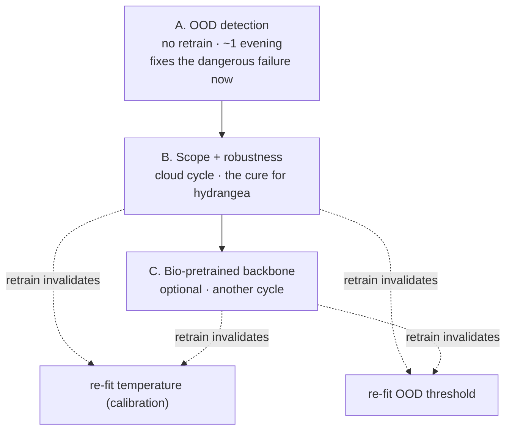

# Model overhaul — OOD, scope, and modeling

Planning doc, opened **2026-07-24** after real phone testing surfaced a class
of failure the current model can't handle. This is the "how" behind the
queued *Long-tail OOD / not-sure* goal in `GOALS.md`, plus one scope decision
that goal doesn't cover. Nothing here is committed to code yet — it exists so
we agree the sequence and the cost before spending GPU hours.

---

## 0. The failure that triggered this

One cultivated hydrangea, photographed from three angles, produced three
different confident answers:

| angle | top-1 | shown as | notable |
|-------|-------|----------|---------|
| 1 | Alderleaf Buckthorn (*Rhamnus alnifolia*) | 52% "Possible match" | wrong |
| 2 | Chia (*Salvia hispanica*) | 20% "Uncertain" (not-sure banner) | Wild Hydrangea sat at #2, 18% |
| 3 | Black Swallow-Wort (*Vincetoxicum nigrum*) | 78% "Likely match" | **flagged "Invasive weed"** |

Two root causes, compounding:

1. **Out of distribution (OOD).** A garden hydrangea (*H. macrophylla* /
   *paniculata*) is a **cultivated ornamental**, and iNaturalist research-grade
   — our entire training source — **excludes cultivated plants** (they're
   marked "casual"). The model was never shown one. It *does* carry the native
   *Hydrangea arborescens*, which is why "Wild Hydrangea" flickered in at #2,
   but the cultivated species has no correct class to land on.
2. **No abstention.** When the true species isn't in scope, the model is
   forced to name the nearest in-scope class. The logits are meaningless for an
   OOD input, so tiny angle changes flip the winner. **The instability across
   the three angles IS the OOD signature** — the model is effectively saying "I
   don't recognize this," and we aren't surfacing it.

The worst single outcome is angle 3: **78% + "Invasive weed" on someone's
ornamental.** A user could act on that and tear out their hydrangea. That is the
failure this overhaul must kill first.

**Note the calibration we shipped earlier today does not help here.**
Temperature scaling (T=0.6) is correct for *in-scope* inputs, but it operates
on logits that are meaningless for OOD — and by sharpening them it made angle
3 look *more* confident (78%). Calibration and OOD are orthogonal: one makes an
in-scope number honest, the other decides whether the number should be trusted
at all. We need both.

---

## 1. Decisions (resolved 2026-07-24)

1. **Ornamental scope — YES, expand to garden plants.** New north star:
   *identify what a CT user photographs, wild **or** cultivated.* Key insight
   from Kyle: **garden plants aren't geographically scoped** the way wild flora
   is — a garden hydrangea is the same species in CT or Oregon, and most
   ornamentals are imported. So the scope splits in two:
   - *Wild set:* stays CT-scoped, research-grade (native + naturalized), as now.
   - *Garden set:* a curated list of **common cultivated ornamentals grown in
     US/Northeast gardens, regardless of native origin** — NOT geographically
     filtered. This must be **bounded** ("common garden plants in general" is
     unbounded); practical definition = the most-planted landscape/ornamental
     species someone in CT would actually have (~a few hundred, ranked by how
     common they are, sourced from horticulture lists + iNat-casual frequency).
   - Final model scope = CT wild flora ∪ common cultivated ornamentals. Status
     lookup still per-species (most ornamentals → "introduced/ornamental").
   - **Open sub-decision:** the exact garden-list size/source (see §3, B1).
2. **OOD UX — suppress the weed/status flag when out-of-scope.** Confirmed. A
   status flag on an unrecognized plant is the exact harm we're removing.
3. **Modeling — GREEN-LIT: BioCLIP backbone, but with a genuine contribution.**
   Kyle's constraint: *don't just fine-tune their model and call it mine* —
   improve the architecture in a way that fits this problem. Design in §4.
4. **Budget — ~$30 total, a few overnight A10 cycles.** ~3–4 cycles at
   ~$7–10 each. Be economical: prototype on a subset before any full run;
   Workstream A is free (no GPU).

Update `GOALS.md`'s north star + `Stack` to reflect the wild∪garden scope.

---

## 2. Workstream A — OOD detection *(do first; no retrain, ~1 evening)*

**Goal.** When a photo's true species isn't in the 2,360-class scope, abstain —
"this looks outside my Connecticut-wild scope (maybe a garden ornamental)" —
instead of forcing a confident wrong class or a false weed flag.

**Why softmax isn't enough (even calibrated).** Softmax normalizes over the
in-scope classes *only*. It answers "which of my classes is most likely," never
"does this belong to any of my classes." An OOD input can still produce a high
max-softmax (angle 3's 78%). The signal we need — "how far is this from anything
I was trained on" — lives in **feature space**, not logit space.

**Primary approach — Mahalanobis distance on penultimate features**
(Lee et al. 2018):

1. Take the ~1280-d embedding from the layer *before* the classifier head for a
   sample of training images per class (we have the local dataset already).
2. Fit a class-conditional Gaussian: per-class mean μ_c and a **tied**
   covariance Σ (shared across classes — more stable with limited per-class
   data).
3. OOD score = min over classes of the Mahalanobis distance
   D(x) = (f(x) − μ_c)ᵀ Σ⁻¹ (f(x) − μ_c). Large min-distance = far from every
   class = OOD.

**Complementary signal — test-time-augmentation (TTA) disagreement.** This
failure *is* disagreement across views. Run the model on a few augmented crops
of one photo; if the top prediction is unstable / entropy is high across views,
that's OOD-suspect. Cheap, intuitive, and it directly operationalizes what we
observed. Prototype it alongside Mahalanobis and combine (or pick the stronger).

**Alternatives considered:** energy score (logsumexp of logits — still
logit-based, weak for far-OOD; keep as a cheap tiebreaker), kNN distance to a
stored embedding bank (Sun et al. 2022 — non-parametric, robust; good
cross-check against Mahalanobis if Σ⁻¹ is finicky).

**Threshold tuning (asymmetric — real plants must pass).**

- *In-scope positives:* held-out **test** photos of real CT species (reuse the
  `calibrate.py` download). These MUST pass — we accept rejecting ≤ 2–3%.
- *OOD negatives:* (a) the hydrangea + a set of common ornamentals from iNat
  "casual"; (b) non-plants (dogs, cars, faces from ImageNet); (c) optionally
  species deliberately outside CT.
- Pick τ to maximize OOD recall subject to in-scope false-reject ≤ 2–3%. Report
  **AUROC** and **FPR@95%TPR** (the standard OOD metrics; the `GOALS.md` gate is
  AUROC ≥ 0.85).

**Product integration.** New response field `out_of_scope: bool` (+ score). In
that state the hero shows a distinct message and **suppresses the weed flag**;
candidates stay visible but de-emphasized ("closest matches, treat with
caution").

**Cost:** ~1 evening, CPU/MPS, **no retrain.**
**Success criteria:** all 3 hydrangea angles → out-of-scope (no confident
species, no weed flag); in-scope test plants ≤ 2–3% wrongly flagged; a dog/car
→ flagged; AUROC ≥ 0.85 on the benchmark.
**Risk:** over-rejection of real CT plants → mitigated by the asymmetric
threshold and the "must pass" benchmark. The local cap-150 subset may not
perfectly represent full-scope feature stats — use all available per-class
images.

---

## 3. Workstream B — data / scope + robustness *(the cure; one cloud cycle)*

**Goal.** (a) Bring common cultivated ornamentals into scope so hydrangea gets a
*correct* class; (b) kill the cross-angle instability with augmentation.

**B1 — scope expansion (cultivated ornamentals).** Root cause is the
research-grade filter. Fix: for a **curated ornamental list only**, relax the
filter to pull `quality_grade=casual` / `captive=true` observations for ~50–150
common Northeast landscaping species (hydrangea macrophylla/paniculata/
quercifolia, hosta, boxwood, daylily, peony, rhododendron/azalea, spirea…).
Caveats: casual observations are noisier (mislabels, garden tags, mixed
plants) → needs a cleaning/verification pass (`verify_images.py` pattern + a
manual spot-check). Alternative sources if iNat casual is too dirty: GBIF
cultivated records, Pl@ntNet. **Decision 1 sets the list.**

**B2 — robustness augmentation.** Add motion/gaussian blur, brightness/contrast
jitter, perspective/rotation, cutout — simulating the phone-photo variance that
flipped the three angles. Add **TTA at inference** for stability (also feeds
Workstream A's disagreement signal).

**B3 — revisit label smoothing.** Smoothing (0.1) drove the underconfidence we
fixed with temperature. Now that we understand the tradeoff, consider dropping
it to 0.05 (then re-fit temperature). Document the interaction.

**Retrain.** Full-history fit on the A10, two-stage progressive resize
(224 → 384), including ornamentals + augmentations. **After retrain, re-fit both
the calibration temperature and the OOD threshold** — they're model-specific and
change with the new class set.

**Cost:** overnight A10 (~$6–10) + data-pull time. The expensive workstream.
**Success criteria:** hydrangea → correct hydrangea class/genus in top-3;
same-plant 3-angle stability (same top-1, or same top-3 set); in-scope accuracy
holds (≥ 79% top-1).
**Risk:** noisy ornamental data can dip overall accuracy → clean + hold out a
labeled ornamental test set; watch per-tier metrics.

---

## 4. Workstream C — modeling *(last, selective; another cycle)*

Lowest leverage for *this* failure — a bigger model doesn't fix a data/abstention
gap. One bet is worth making because it serves A and B, not accuracy alone.

| option | relevance | tradeoff |
|--------|-----------|----------|
| **Bio-pretrained backbone** (BioCLIP / iNat21 ViT or EffNet) | **highest** — biology-tuned features → better fine-grained accuracy *and* cleaner clusters for OOD | ViT recipe differs (aug/lr); heavier; re-benchmark |
| Bigger EffNetV2-M/L or ConvNeXt | low | +few pts top-1 for more CPU latency (serving budget) |
| Higher input res (>384) | low | diminishing returns, more latency |
| Metric-learning head (ArcFace) | medium | better-separated embeddings (helps accuracy + OOD) but a bigger recipe change |

**Recommendation:** BioCLIP as the frozen/partially-tuned feature backbone,
**not** as the whole model. The contribution is what we build on top (below).

### Making it genuinely ours (Kyle's constraint)

First, honesty on the framing: **building on a pretrained backbone is standard
and legitimate** — essentially every production vision model fine-tunes one; you
are not "claiming BioCLIP as yours" by using it. But the instinct to add a real
contribution beyond vanilla fine-tuning is the right one for a portfolio, and
there's a clean way to do it that also *fits this exact problem* (fine-grained +
long-tail + OOD-heavy + phone photos):

- **Centerpiece — a prototype / metric-learning head (recommended).** Replace
  the plain linear classifier with learned **class prototypes** in BioCLIP's
  embedding space (prototypical-network or ArcFace style). Why it fits: the
  *same* distance-to-nearest-prototype is both the classification score **and**
  the OOD score — so Workstream A and Workstream C become one mechanism instead
  of a classifier plus a bolted-on detector. That unification is a genuine
  design choice motivated by our failure, not a stock recipe.
- **Hierarchical genus→species head.** BioCLIP was trained on the taxonomic tree;
  exploit it. Predict genus and species jointly so the model degrades gracefully
  to genus on the sparse tail (directly serves the `GOALS.md` genus-fallback
  philosophy). A real architectural addition, purpose-built for the long tail.
- **Abstention-aware training.** Fold "reject" into training (an energy/entropy
  regularizer, or explicit non-plant / ornamental-vs-wild negatives) so
  abstention is learned, not only a post-hoc threshold.
- **Text-tower few-shot for the tail (stretch).** BioCLIP is CLIP — it has a text
  encoder. Blend zero/few-shot via species-name prompts for classes with too few
  photos to fit a prototype. Uses BioCLIP for what it *uniquely* offers
  (vision-language), not just as a frozen trunk.

**Recommended for the budget:** prototype head (unifies A+C) + hierarchical
genus/species. Defer text-tower and metric-head exotica unless cycles remain.
The OOD/abstention system, the wild∪garden data curation, and this
purpose-built head are the parts that are unambiguously *ours*.

**Success criteria:** in-scope top-1 +3–5 pts **or** OOD AUROC up, prototype
distance gives OOD "for free," without blowing the CPU serving latency budget.

---

## 5. Sequencing & dependencies

**Cross-cutting rule:** every retrain invalidates the calibration temperature
*and* the OOD threshold — both are model-specific artifacts (`temperature.json`,
future `ood.json`) that live with the checkpoint outside git and must be
regenerated after any model change.

## 6. Cost summary

| workstream | GPU | wall-clock | ~cost | fixes |
|------------|-----|-----------|-------|-------|
| A — OOD | none | ~1 evening | $0 | the dangerous confident-wrong answer |
| B — scope+robustness | A10 overnight | 1 cloud cycle | ~$6–10 | hydrangea gets a correct class; angle stability |
| C — bio backbone | A10 | 1 cloud cycle | ~$6–10 | marginal accuracy + OOD separability |

**Recommended order: A → B → C.** A buys safety immediately at zero GPU cost;
B is the actual cure; C is a refinement worth doing only once A and B land.
